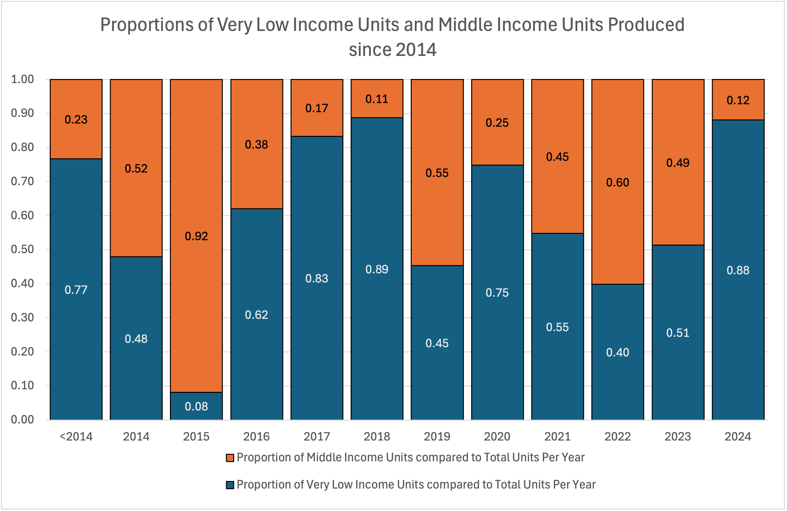

```{r setup, include=FALSE}
knitr::opts_chunk$set(echo = TRUE)
```

## Introduction 
Poverty and homelessness have always been prevailing issues in the U.S. and in recent years have become even more prominent issues. Housing prices have been rising and many Americans find it hard to afford housing. We wanted to see if there is any evidence that suggest that more low income housing is being produced compared to that of middle income housing. To answer this question, we used data from NYC Open Data to compare the number of very low-income housing units that are produced to that of middle-income households. This will allow us to analyze if there is or isn't a difference in the proportion of very-low income households that have been produced compared to that of middle income households. In this report we will show that there is a statistically significant difference in the proportions of very low-income households and middle-income households that have been produced in New York City since 2014. Meaning that from the evidence there may be efforts being made to help resolve the housing crisis especially for very low-income individuals.  

## Background 
The dataset we decided to use is published on the NYC Open Data website. The Department of Housing Preservation Development generates reports on projects, buildings, and units that began development after January 1, 2014. Each row of data refers to a different housing project in New York City. The key variables are very low-income units’ middle-income units and project completion date. It is these metrics that we conducted our analysis on. 
These datapoints are counted towards either the Housing New York plan
(1/1/2014 - 12/31/2021) or the Housing our Neighbours: A Blueprint for
Housing and Homelessness plan (1/1/2022 - present).

Data collection method could be administrative tracking of affordable
housing development projects and comprehensive documentation of projects
initiated after January 1, 2014.

The key variables are very low income units (Numerical), middle income units (Numerical), and
project start date (Floating Timestamp). Each row of data is a different housing project or preservation project
that has been developed since 2014. The dataset, unfiltered, has 4634 rows and 19 columns. When filtered into a month-wise aggregation, it has 12 months per year for every year from 2014 to 2024.

Some charts to help visualize the data and understand what statistical analysis we could perform.

1.  Bar Chart of Housing Units

X-axis: Income Categories (Very Low, Middle) Y-axis: Number of Units
Purpose: Compare absolute number of units by income level Shows visual
representation of unit distribution

2.  Split Bar Chart of Unit Proportions 

Slices representing:

Very Low Income Units (%) Middle Income Units (%)

Purpose: Illustrate percentage breakdown of housing units Highlights
relative proportion of each income category 


3.  Time Series Line Graph

X-axis: Years (2014-2024) Y-axis: Number of Units Points showing:

Very Low Income Units per month Middle Income Units per month

Purpose: Show unit production trends over time


## Analysis

### Two Proportion Z-Test
The analysis employs a two-proportion z-test to compare the proportions of Very Low Income and Middle Income housing units over time. The statistical hypothesis test is designed to determine if there are significant differences in the housing unit distributions.

#### Z-Test
$z = \frac{\hat{p}1 - \hat{p}2}{\sqrt{\hat{p}_{pooled}(1-\hat{p}_{pooled})(\frac{1}{n_1} + \frac{1}{n_2})}}$
Where:

$\hat{p}_1$ is the proportion of Very Low Income units  
$\hat{p}_2$ is the proportion of Middle Income units  
$\hat{p}_{pooled}$ is the pooled proportion  
$n_1$ and $n_2$ are the total number of units in each category  


```{r echo = FALSE, warning = FALSE, message = FALSE}
library(tidyverse)

# Read the CSV
housing_data <- read_csv("Affordable_Housing_Production_by_Project_20241202.csv")

# Data Preprocessing
processed_data <- housing_data %>%
  # Remove rows with NA in key columns
  drop_na(`Project Start Date`, `Very Low Income Units`, `Middle Income Units`, `Total Units`) %>%
  # Parse dates using specific format
  mutate(
    project_start_date = as.Date(`Project Start Date`, format = "%m/%d/%Y"),
    project_start_year = year(project_start_date)
  ) %>%
  # Filter for 2014-2024 range
  filter(
    project_start_year >= 2014 & 
    project_start_year <= 2024
  )

# 1. Bar Chart of Housing Units
bar_chart <- processed_data %>%
  group_by(project_start_year) %>%
  summarise(
    very_low_income = sum(`Very Low Income Units`, na.rm = TRUE),
    middle_income = sum(`Middle Income Units`, na.rm = TRUE)
  ) %>%
  pivot_longer(cols = c(very_low_income, middle_income), 
               names_to = "income_category", 
               values_to = "units") %>%
  ggplot(aes(x = project_start_year, y = units, fill = income_category)) +
  geom_bar(stat = "identity", position = "dodge") +
  labs(
    title = "Affordable Housing Units by Income Category",
    x = "Year",
    y = "Number of Units",
    fill = "Income Category"
  ) +
  theme_minimal()

# 2. Pie Chart of Unit Proportions
pie_chart_data <- processed_data %>%
  summarise(
    very_low_income = sum(`Very Low Income Units`, na.rm = TRUE),
    middle_income = sum(`Middle Income Units`, na.rm = TRUE)
  ) %>%
  pivot_longer(cols = everything(), names_to = "category", values_to = "units")

pie_chart <- pie_chart_data %>%
  ggplot(aes(x = "", y = units, fill = category)) +
  geom_bar(stat = "identity", width = 1) +
  coord_polar("y", start = 0) +
  labs(
    title = "Proportion of Housing Units by Income Category",
    fill = "Income Category"
  ) +
  theme_void()

# 3. Time Series Line Graph
time_series <- processed_data %>%
  group_by(project_start_year) %>%
  summarise(
    very_low_income = sum(`Very Low Income Units`, na.rm = TRUE),
    middle_income = sum(`Middle Income Units`, na.rm = TRUE)
  ) %>%
  pivot_longer(cols = c(very_low_income, middle_income), 
               names_to = "income_category", 
               values_to = "units") %>%
  ggplot(aes(x = project_start_year, y = units, color = income_category, group = income_category)) +
  geom_line(linewidth = 1) +
  geom_point() +
  labs(
    title = "Housing Units Over Time by Income Category",
    x = "Year",
    y = "Number of Units",
    color = "Income Category"
  ) +
  theme_minimal()

# Statistical Analysis
total_very_low <- sum(processed_data$`Very Low Income Units`, na.rm = TRUE)
total_middle <- sum(processed_data$`Middle Income Units`, na.rm = TRUE)
total_units <- sum(processed_data$`Total Units`, na.rm = TRUE)

prop_very_low <- total_very_low / total_units
prop_middle <- total_middle / total_units

# Two-proportion z-test (manual calculation)
pooled_prop <- (total_very_low + total_middle) / (2 * total_units)
se <- sqrt(pooled_prop * (1 - pooled_prop) * (2 / total_units))
z_stat <- (prop_very_low - prop_middle) / se
p_value <- 2 * (1 - pnorm(abs(z_stat)))

# Print results
cat("Two-Proportion Z-Test Results:\n")
cat("Z-statistic:", z_stat, "\n")
cat("P-value:", p_value, "\n")
cat("Proportion of Very Low Income Units:", prop_very_low, "\n")
cat("Proportion of Middle Income Units:", prop_middle, "\n")

# Optional: Print all 3 plots
print(bar_chart)
print(pie_chart)
print(time_series)


```


#### Hypothesis


Null Hypothesis (H₀): There is no significant difference in the proportion of Very Low Income units compared to Middle Income units.

- Mathematically: H₀: p₁ = p₂
(The proportion of Very Low Income units is equal to the proportion of Middle Income units)


Alternative Hypothesis (H₁): There is a significant difference in the proportion of Very Low Income units compared to Middle Income units.

- Mathematically: H₁: p₁ ≠ p₂
(The proportions are statistically different)

#### Findings
Overall Proportions

- Proportion of Very Low Income Units: 20.74%
- Proportion of Middle Income Units: 9.21%
- Z-statistic: 136.80
- P-value: 0.000 (effectively zero)

Since these findings are very indicative of the existence of a considerable difference in housing projects for middle income and very low income households, we strove to find the nature of this difference. Mainly, we sought to see whether the housing projects started at particular seasons of the year (monthly analysis) and what years was there a stark need for very low income households over middle income households to be constructed.


```{r echo=FALSE}

processed_data <- housing_data %>%
  mutate(
    project_start_year = as.numeric(str_extract(`Project Start Date`, "\\d{4}")),
    project_start_month = as.numeric(str_extract(`Project Start Date`, "^\\d+"))
  ) %>%
  filter(project_start_year >= 2014 & project_start_year <= 2024)

# Data Preprocessing
processed_data <- housing_data %>%
  drop_na(`Project Start Date`, `Very Low Income Units`, `Middle Income Units`, `Total Units`) %>%
  mutate(
    project_start_date = as.Date(`Project Start Date`, format = "%m/%d/%Y"),
    project_start_year = year(project_start_date),
    project_start_month = month(project_start_date, label = TRUE)
  ) %>%
  filter(project_start_year >= 2014 & project_start_year <= 2024)

# Yearwise Analysis
yearwise_analysis <- processed_data %>%
  group_by(project_start_year) %>%
  summarise(
    very_low_units = sum(`Very Low Income Units`),
    middle_units = sum(`Middle Income Units`),
    total_units = sum(`Total Units`),
    very_low_prop = very_low_units / total_units,
    middle_prop = middle_units / total_units
  )

# Monthwise Analysis
monthwise_analysis <- processed_data %>%
  group_by(project_start_month) %>%
  summarise(
    very_low_units = sum(`Very Low Income Units`),
    middle_units = sum(`Middle Income Units`),
    total_units = sum(`Total Units`),
    very_low_prop = very_low_units / total_units,
    middle_prop = middle_units / total_units
  )

# Yearwise Visualization
yearwise_plot <- yearwise_analysis %>%
  pivot_longer(cols = c(very_low_units, middle_units), 
               names_to = "unit_type", 
               values_to = "units") %>%
  ggplot(aes(x = project_start_year, y = units, fill = unit_type)) +
  geom_bar(stat = "identity", position = "dodge") +
  labs(title = "Yearly Housing Units by Income Category",
       x = "Year", y = "Number of Units") +
  theme_minimal()

# Monthwise Visualization
monthwise_plot <- monthwise_analysis %>%
  pivot_longer(cols = c(very_low_units, middle_units), 
               names_to = "unit_type", 
               values_to = "units") %>%
  ggplot(aes(x = project_start_month, y = units, fill = unit_type)) +
  geom_bar(stat = "identity", position = "dodge") +
  labs(title = "Monthly Housing Units by Income Category",
       x = "Month", y = "Number of Units") +
  theme_minimal()

# Print analyses and plots
print(yearwise_plot)
print(monthwise_plot)
# Yearly Z-Test
yearly_data <- housing_data %>%
  mutate(year = as.numeric(str_extract(`Project Start Date`, "\\d{4}"))) %>%
  filter(year >= 2014 & year <= 2024) %>%
  group_by(year) %>%
  summarise(
    very_low_units = sum(`Very Low Income Units`, na.rm = TRUE),
    middle_units = sum(`Middle Income Units`, na.rm = TRUE),
    total_units = sum(`Total Units`, na.rm = TRUE)
  ) %>%
  mutate(
    very_low_prop = very_low_units / total_units,
    middle_prop = middle_units / total_units,
    pooled_prop = (very_low_units + middle_units) / (2 * total_units),
    se = sqrt(pooled_prop * (1 - pooled_prop) * (2 / total_units)),
    z_stat = (very_low_prop - middle_prop) / se,
    p_value = 2 * (1 - pnorm(abs(z_stat)))
  )

# Monthly Z-Test
monthly_data <- housing_data %>%
  mutate(month = as.numeric(str_extract(`Project Start Date`, "^\\d+"))) %>%
  group_by(month) %>%
  summarise(
    very_low_units = sum(`Very Low Income Units`, na.rm = TRUE),
    middle_units = sum(`Middle Income Units`, na.rm = TRUE),
    total_units = sum(`Total Units`, na.rm = TRUE)
  ) %>%
  mutate(
    very_low_prop = very_low_units / total_units,
    middle_prop = middle_units / total_units,
    pooled_prop = (very_low_units + middle_units) / (2 * total_units),
    se = sqrt(pooled_prop * (1 - pooled_prop) * (2 / total_units)),
    z_stat = (very_low_prop - middle_prop) / se,
    p_value = 2 * (1 - pnorm(abs(z_stat)))
  )

print(yearly_data[, c("year", "very_low_prop", "middle_prop", "z_stat", "p_value")])
print(monthly_data[, c("month", "very_low_prop", "middle_prop", "z_stat", "p_value")])


```
Looking at the results:

Yearly Variations:

- 2017-2020 show extreme differences in proportions
- 2022 shows the most balanced proportions


Monthly Variations:

- March (month 3) shows the most extreme difference
- July and October show relatively smaller disparities

## Discussion 
### Statistical Significance
The extremely small p-values (0 in most years) indicate that the differences between very-low-income and middle-income housing proportions are not random - they represent real, deliberate policy choices in housing development.  

### Shortcomings
The data does not account for the total housing demand within each income category, which is crucial for understanding whether the supply of affordable housing meets the actual need. Additionally, the analysis focuses on the number of units constructed, without considering occupancy rates, which could reveal discrepancies between housing availability and actual usage. 

### Additional Questions to consider
Future research questions could explore how many people from each income category have successfully obtained and retained housing, as this would offer a clearer picture of the effectiveness of these housing efforts. Additionally, comparing these findings to other major cities would provide a wider context for evaluating the success of New York City when it comes to addressing the housing crisis.
